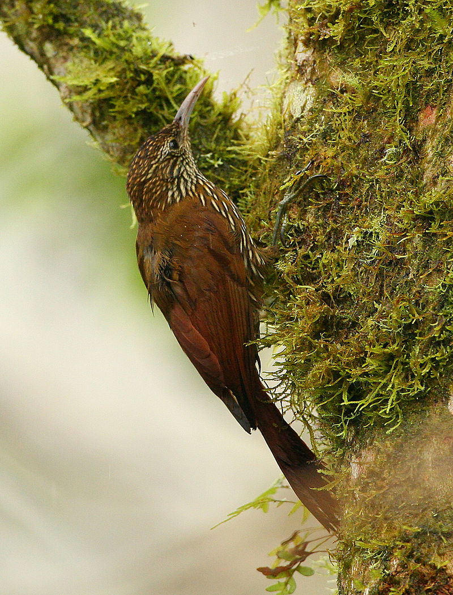
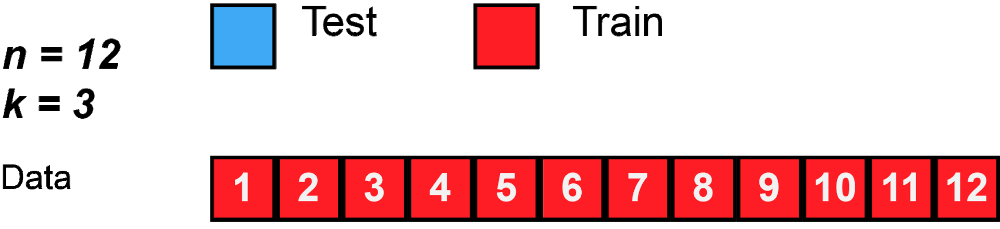

# Preparation

Start R in the bash terminal and run the following lines to install the libraries. 

```{r, eval=FALSE, message=FALSE}
    install.packages("e1071")
    install.packages("caret")
    install.packages("rworldmap")
    install.packages("maptools")
    install.packages("rgeos")
    install.packages("reshape")
    install.packages("randomForest")
```

```{r, warning=FALSE}
library(ggplot2)
library(rgdal)
library(raster)
library(rgeos)
library(reshape)
library(rasterVis)
library(dismo)
library(InformationValue)
library(mgcv)
library(randomForest)
library(e1071)
library(caret)
```

```{r}
set.seed(30)
```

# Data Exploration

We will use Montane woodcreper (Lepidocolaptes lacrymiger) as example species. 

This species has a large range, occurring from the coastal cordillera of Venezuela along the Andes south to south-east Peru and central Bolivia.

```{r, echo=FALSE}

```

# Read in points data 

## Load observation presence dataset

Let's suppose that you have done field work and you have collected the bird presence in the Lepidocolaptes_lacrymiger_allpoints.csv file

```{r}
 points_field <- read.csv("./geodata/shp/Lepidocolaptes_lacrymiger_allpoints.csv")
 str(points_field)
```

Morover you also download aditional points data from the https://www.gbif.org/ . 

```{r}
# gbif_points = gbif('Lepidocolaptes' , 'lacrymiger' , download=T , geo=T , ext=c(-82,-59,-21,14) , removeZeros=TRUE )
# save(gbif_points , file="~/SE_data/exercise/geodata/SDM/gbif_points.Rdata")
load("./geodata/SDM/gbif_points.Rdata")
points=rbind.data.frame(
  data.frame(lat=gbif_points$lat,lon=gbif_points$lon),
  data.frame(lat=points_field$lat,lon=points_field$lon)
)
str(points)
```

## Load the environmental data layers

```{r}
rCld   <- raster("./geodata/cloud/SA_meanannual.tif")
# compute min and max
rCld   =  setMinMax(rCld)
rCldIA <- raster("./geodata/cloud/SA_intra.tif")
rCldIA =  setMinMax(rCldIA)
rElv   <- raster("./geodata/dem/SA_elevation_mn_GMTED2010_mn_msk.tif")
rElv   =  setMinMax(rElv)
rVeg   <- raster("./geodata/vegetation/SA_tree_mn_percentage_GFC2013.tif")
rVeg   =  setMinMax(rVeg)
rElv
```

## Load expert range map 

```{r}
birdrange <- readOGR("./geodata/shp", "cartodb-query")
```

```{r}
plot(rElv)
points(points$lon, points$lat, col = "red", cex = .3)
plot(birdrange,add=TRUE)
```

```{r}
# indicate that these data are presences
presence <- matrix(1,nrow(points),1)
points <- cbind(points,presence)
```

```{r}
head(points)
```

```{r}
# building spatial dataframe
coordinates(points)=c('lon','lat')
```

```{r}
str(points)
```

```{r}
# assign projection
projection(points) <- "+proj=longlat +datum=WGS84" 
```

Loading eBird sampling dataset, in order to obtain “absence” data

```{r}
# link to global sampling raster
# first crop with the gdal and then load the cropversion
system("gdal_translate -projwin -82 14 -59 -21 -co COMPRESS=DEFLATE -co ZLEVEL=9 ./geodata/SDM/eBirdSampling_filtered.tif ./geodata/SDM/eBirdSampling_filtered_crop.tif")
gsampling <- raster("./geodata/SDM/eBirdSampling_filtered_crop.tif")
```

```{r}
# assign projection
projection(gsampling)="+proj=longlat +datum=WGS84"
gsampling
```

```{r}
# convert to points within data region
samplingp <- as(gsampling,"SpatialPointsDataFrame")
samplingp <- samplingp[samplingp$eBirdSampling_filtered_crop>0,]
str(samplingp)
head(samplingp)
```

```{r}
 # edit column names
 colnames(samplingp@data) <- c("observation")
 samplingp$presence=0
 plot(samplingp, col="green",pch=21,cex=.5)#absences
 plot(points, col="red",add=TRUE)#presences
 plot(birdrange, col="cyan",add=TRUE)#species range
```

```{r}
summary(samplingp)
```

combine presence and non-presence point datasets

```{r}
pdata <- rbind(points[,"presence"],samplingp[,"presence"])
pdata@data[,c("lon","lat")] <- coordinates(pdata)
table(pdata$presence)
```

## Plot the environmental data layers

```{r}
env <- stack(c(rCld,rCldIA,rElv,rVeg))
env
```

```{r}
# rename layers for convenience
vars <- c("cld","cld_ia","elev","forest")

names(env) <- vars
 
# visual result 
options(repr.plot.width=15, repr.plot.height=9)
 # check out the plot
plot(env)
```

Scaling and centering the environmental variables to zero mean and variance of 1

```{r}
senv <- scale(env[[vars]])
senv
# this operation is quite long. Would be possible to do in gdal? how?
```

```{r}
hist(env)
hist(senv)
```

Annotate the point records with the scaled environmental data

```{r}
df.xact <- raster::extract(senv,pdata,sp=T) 
```

```{r}
df.xact <- (df.xact[! is.na(df.xact$forest),])
```

## Correlation plots

```{r}
## convert to 'long' format for easier plotting
df.xactl <- reshape::melt(df.xact@data,id.vars=c("lat","lon","presence"),variable.name="variable")
```

```{r}
head(df.xactl)
```

```{r}
tail(df.xactl)
```

```{r}
ggplot(df.xactl,aes(x=value,y=presence))+facet_wrap(~variable)+
  geom_point()+
  stat_smooth(method = "lm", formula = y ~ x + I(x^2), col="red")+
  geom_smooth(method="gam",formula=y ~ s(x, bs = "cs")) + 
  theme(text = element_text(size = 20))  
```

# Model Fitting


## Cross validation 

```{r, echo=FALSE}

```


```{r}
df.xact <- as.data.frame(df.xact)
```

```{r}
df.xact$grp <- kfold(df.xact,2)
```

```{r}
head(df.xact)
```

```{r}
mdl.glm <- glm(presence~cld+cld_ia*I(cld_ia^2)+elev*I(elev^2)+forest, family=binomial(link=logit), data=subset(df.xact,grp==1))
```

```{r}
summary(mdl.glm)
```

# Prediction

Calculate estimates of p(occurrence) for each cell.
We can use the predict function in the raster package to make the predictions across the full raster grid and save the output.

```{r}
pred.glm1 <- predict(mdl.glm,df.xact[which(df.xact$grp==1),vars],type="response")
pred.glm2 <- predict(mdl.glm,df.xact[which(df.xact$grp==2),vars],type="response")
```

```{r}
plotROC(df.xact[which(df.xact$grp==1),"presence"],pred.glm1)
```

```{r}
plotROC(df.xact[which(df.xact$grp==2),"presence"],pred.glm2)
```

## Out mapping

```{r}
p1 <- raster::predict(senv,mdl.glm,type="response")
```

Plot the results as a map:

```{r}
options(repr.plot.width=8, repr.plot.height=9)
gplot(p1)+geom_tile(aes(fill=value))+
  scale_fill_gradientn(
    colours=c("blue","green","yellow","orange","red"),
    na.value = "transparent")+
  geom_polygon(aes(x=long,y=lat,group=group),
               data=fortify(birdrange),fill="transparent",col="darkred")+
  geom_point(aes(x = lon, y = lat), data = subset(df.xact,presence==1),col="black",size=0.5)+
  coord_equal()
```

# Cross Validation

The library caret allow an easy implementation of the Cross Validation for several models.

```{r}
ctrl <- trainControl(method = "cv", number = 10)

mdl.glm.cv <- train(  as.factor(presence) ~cld+cld_ia*I(cld_ia^2)+elev*I(elev^2)+forest,
                      family=binomial(link=logit),  data = df.xact, method = "glm", trControl = ctrl,
                      metric='Accuracy', na.action=na.exclude)
```

```{r}
mdl.glm.cv
```

Predict in terms of presence/absence

```{r}
pred.mdl.glm.cv.raw <- raster::predict(senv,mdl.glm.cv ,type="raw")
```

```{r}
plot(pred.mdl.glm.cv.raw)
```

Predict and plotting in terms of probability

```{r}
pred.mdl.glm.cv.prob1 <- raster::predict(senv,mdl.glm.cv ,type="prob" , index=1)
plot(pred.mdl.glm.cv.prob1)
```

```{r}
pred.mdl.glm.cv.prob2 <- raster::predict(senv,mdl.glm.cv ,type="prob" , index=2)
plot(pred.mdl.glm.cv.prob2)
```

# References

- https://en.wikipedia.org/wiki/Cross-validation

# Random Forest model

Random Forest is an ensemble learning method for classification, regression and other tasks that operate by constructing a multitude of decision trees at training time and outputting the class that is the mode of the classes (classification) or mean/average prediction (regression) of the individual trees (source https://en.wikipedia.org/wiki/Random_forest) 

The randomForest packages (https://cran.r-project.org/web/packages/randomForest/index.html) allows to run reggression or classification case in R.
(check also ranger: A Fast Implementation of Random Forests  https://cran.r-project.org/web/packages/ranger/index.html )

```{r}
mdl.rf <- randomForest(as.factor(presence) ~ cld + cld_ia + elev +forest, data=subset(df.xact,grp==1),
                       na.action=na.exclude)
```

```{r}
mdl.rf
```

## Predict as presence / absence

(This may take a while to run)

```{r}
pred.rf.resp  <- raster::predict(senv , mdl.rf , type='response')
```

```{r}
plot(pred.rf.resp)
```

## Predict as probability of presence / absence

(This may take a while to run)

```{r}
pred.rf.prob1 <- raster::predict(senv , mdl.rf , type='prob' , index=1)   
pred.rf.prob0 <- raster::predict(senv , mdl.rf , type='prob' , index=2)
```

```{r}
plot(pred.rf.prob1)
plot(pred.rf.prob0)
```

## Predict occurence presence

Create a raste with 10 km resoultion (0.083333333333)

```{r}
occ = raster(nrows=420, ncols=276, xmn=-82, xmx=-59, ymn=-21, ymx=14, crs="+proj=longlat +datum=WGS84 +no_defs +ellps=WGS84 +towgs84=0,0,0" , vals=0)
```

```{r}
occ
```

```{r}
pointcount = function(r, pts){
  # make a raster of zeroes like the input
  r2 = r
  r2[] = 0
  # get the cell index for each point and make a table:
  counts = table(cellFromXY(r,pts))
  # fill in the raster with the counts from the cell index:
  r2[as.numeric(names(counts))] = counts
  return(r2)
 }

occ_raster <- pointcount(occ, points)
```

```{r}
plot(occ_raster)
```

```{r}
occ_point = rasterToPoints(occ_raster , spatial=TRUE)
```

```{r}
str(occ_point)
```

Sampling the occurrence points by eliminating the extremes.

```{r}
occ_point_sel = subset(occ_point , (layer > 0 & layer < 100)  )
```

```{r}
hist(occ_point_sel@data$layer)
```

```{r}
occ_point_sel_predictor <- raster::extract(senv,occ_point_sel,sp=T) 
str(occ_point_sel_predictor)
```

```{r}
mdl.rf.occ <- randomForest( layer ~ cld + cld_ia + elev + forest , data=occ_point_sel_predictor )
mdl.rf.occ
```

```{r}
pred.rf.occ <- raster::predict(senv , mdl.rf.occ , type='response')
```

```{r}
plot(pred.rf.occ)
```

