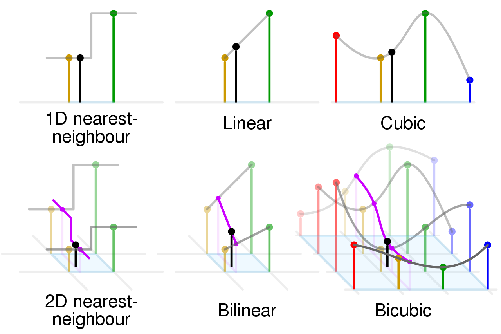
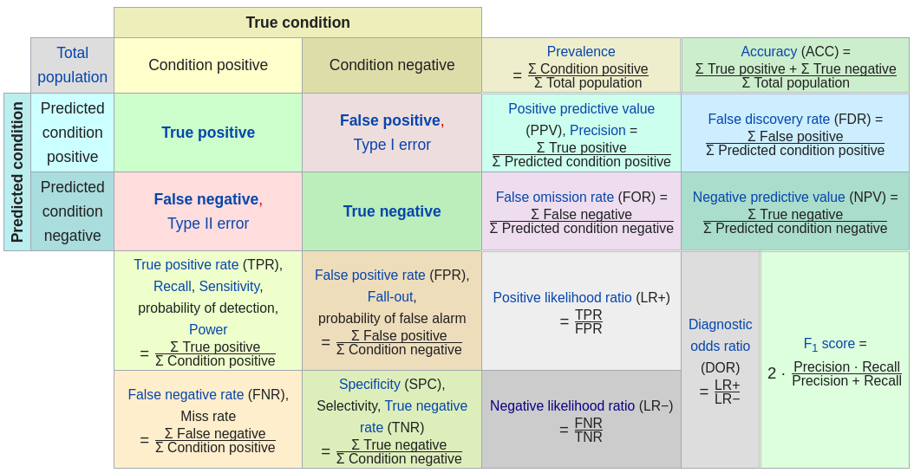
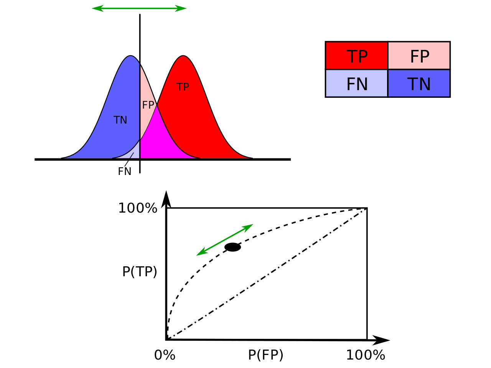

# Preparation

R library that provides bindings to GDAL library. 

```{r, eval=FALSE, message=FALSE}
install.packages("dismo")
install.packages("caret")
devtools::install_github("selva86/InformationValue")
```

```{r, warning=FALSE, echo=FALSE}
library(raster)
library(dismo)
library(caret)
library(InformationValue)
```

```{r, eval=FALSE}
library(raster)
library(dismo)
library(caret)
library(InformationValue)
```

Set your data directory

```{r}
data_dir <- Sys.getenv("se_geocomp_dir")
```


```{r}
set.seed(30)
```

# SDM 

Types 

+ Correlative 
+ Mechanistic 

Data 

+ presence only 
+ presence + absence 

# Species of Interest : Varied Thrush 

The varied thrush breeds in western North America from Alaska to northern California.

It is migratory, with northern breeders moving south within or somewhat beyond the breeding range.

Other populations may only move altitudinally.

```{r, echo=FALSE}
knitr::include_graphics(paste0(data_dir, "/images/varied_thrush.jpg"))
```

# Read in data 

```{r}
vath.data <- read.csv("./txt/vath_2004.csv")
vath.val <- read.csv("./txt/vath_VALIDATION.csv")
```

```{r}
head(vath.data)
```

```{r}
# split dataset by presence 
vath.pres <- vath.data[vath.data$VATH==1,]
vath.abs <- vath.data[vath.data$VATH==0,] 
vath.pres.xy <- as.matrix(vath.pres[,c("EASTING","NORTHING")]) 
vath.abs.xy <- as.matrix(vath.abs[,c("EASTING","NORTHING")])
```

```{r}
# validation dataset
vath.val.pres <- as.matrix(vath.val[vath.val$VATH==1, c("EASTING","NORTHING")]) 
vath.val.abs <- as.matrix(vath.val[vath.val$VATH==0, c("EASTING","NORTHING")]) 
vath.val.xy <- as.matrix(vath.val[,c("EASTING","NORTHING")])
```

```{r}
head(vath.val.pres)
```

```{r}
# env layers 
elev <- raster("./R_db/elev.gri") # elevation
canopy <- raster("./R_db/cc2.gri") # canopy slope 
mesic <- raster("./R_db/mesic.gri") # mesic forest 
precip <- raster("./R_db/precip.gri") # precipitation
```

```{r}
#check maps 
compareRaster(elev, canopy) 
```

```{r, eval=FALSE}
compareRaster(elev, mesic)
```

```{r}
elev
```

```{r}
mesic
```

```{r}
precip
```

Interpolation


```{r, echo=FALSE}

```

```{r}
# resampling 
mesic <- resample(x=mesic, y=elev, "ngb")
precip <- resample(x=precip, y=elev, "bilinear")
```

```{r}
#crop to same extent 
mesic <- mask(mesic, elev) 
precip <- mask(precip, elev)
```

```{r}
compareRaster(elev,precip, mesic)
```

```{r}
# creat a forest layer at 1km resolution 
fw.1km <- focalWeight(mesic, 1000, 'circle')
mesic1km <- focal(mesic, w=fw.1km, fun="mean", na.rm=T)
```

```{r}
#create raster stack 
layers <- stack(canopy, elev, mesic, mesic1km, precip) 
names(layers) <- c("canopy", "elev", "mesic", "mesic1km", "precip")
```

```{r}
options(repr.plot.width=18, repr.plot.height=11)
plot(layers,cex.axis=2,cex.lab=2,cex.main=2.5,legend.args=list(text=NULL, side=1, cex.lab = 3, line=2.3))
```

```{r}
options(repr.plot.width=18, repr.plot.height=16)
pairs(layers,maxpixels=1000,cex=0.5)
```

```{r}
#drop correlated layer (mesic) 

layers <- dropLayer(layers, 3)
```

```{r}
#Generate background points using 
# 2000 was chosen for the illustration purpose. 
# This number can be much larger in real practice. 

back.xy <- randomPoints(layers, p=vath.pres.xy, n=2000)
colnames(back.xy) <- c("EASTING","NORTHING")
```

```{r}
head(back.xy)
```

```{r}
options(repr.plot.width=9, repr.plot.height=9)
plot(elev)
points(back.xy)
```

```{r}
#extract GIS data 
pres.idpv <- extract(layers, vath.pres.xy)          
back.idpv <- extract(layers, back.xy)           
val.idpv <- extract(layers, vath.val.xy)            
```

```{r}
#link data 
df.pres <- data.frame(vath.pres.xy, pres.idpv, pres=1) 
df.back <- data.frame(back.xy, back.idpv, pres=0) 
df.val <- data.frame(vath.val, val.idpv)
```

```{r}
head(df.pres)
```

```{r}
#remove any potential NAs 
df.pres <- df.pres[complete.cases(df.pres),] 
df.back <- df.back[complete.cases(df.back),] 
df.val <- df.val[complete.cases(df.val),]
```

```{r}
# merge together 
df.all <- rbind(df.pres, df.back)
```

```{r}
head(df.all)
```

```{r}
# data transformation 
# Scaling and centering the environmental variables to zero mean and variance of 1
predictors <- c("canopy","elev","mesic1km","precip")
df.all[,predictors] <- scale(df.all[,predictors])
```

```{r}
head(df.all)
```

# Model Fitting

Generalized linear model (GLM)

1. An exponential family of probability distributions.

2. A linear predictor $\displaystyle \eta =X\beta$

3. A link function ${\displaystyle g}$ such that ${\displaystyle E(Y\mid X)=\mu =g^{-1}(\eta )}$

```{r}
mdl.vath <- glm(pres~canopy+elev+I(elev^2)+mesic1km+precip, family=binomial(link=logit), data=df.all)
```

```{r}
summary(mdl.vath)
```

# Model Evaluation 

```{r}
df.val[,predictors] <- scale(df.val[,predictors])
```

```{r}
df.val$pred <- predict(mdl.vath,df.val[,predictors],type="response")
```

```{r}
head(df.val)
```

Confusion matrix 


```{r, echo=FALSE}

```

```{r}
cutoff <- optimalCutoff(df.val$VATH, df.val$pred)
```

```{r}
df.val[which(df.val$pred>=cutoff),]
```

```{r}
confusionMatrix(df.val$VATH,df.val$pred,threshold=cutoff)
```

```{r}
specificity(df.val$VATH,df.val$pred,threshold=cutoff)
```

```{r}
sensitivity(df.val$VATH,df.val$pred,threshold=cutoff)
```

```{r}
# Calculate the percentage misclassification error for the given actuals and probaility scores.
misClassError(df.val$VATH,df.val$pred,threshold=cutoff)
```

ROC curves

```{r, echo=FALSE}

```

```{r}
plotROC(df.val$VATH,df.val$pred)
```

# Discussions 

1. HW vs. Project 

2. Future course topics 
    - thematic subjects : eg. GLM, Bayesian, etc.
    - data techniques : eg. transformations, sampling, etc.  
    - case studies 
    - others ? 
 
 
  
**Feedback:** Please Provide input via slack channel by 4pm Dec 8. (EDT)

# References 

   - Geocomputation with R. https://geocompr.robinlovelace.net/
   - Spatial Data Science with R. https://www.rspatial.org/
   - M. Stevens. A Primer Of Ecology With R (2009) 
   - D. Borcard, F. Gillet, and P. Legendre. Numerical Ecology with R (2018)
   - R. Fletcher and M. Fortin. Spatial Ecology and Conservation Modeling Applications with R (2018)
   - Spatial Modeling in GIS and R for Earth and Environmental Sciences (2019) ISBN : 978-0128152263
   - https://en.wikipedia.org/wiki/Varied_thrush
   - https://en.wikipedia.org/wiki/Mesic_habitat
   - https://en.wikipedia.org/wiki/Generalized_linear_model
   - https://en.wikipedia.org/wiki/Binomial_distribution
   - https://en.wikipedia.org/wiki/Receiver_operating_characteristic
   - https://en.wikipedia.org/wiki/Bilinear_interpolation
   - https://en.wikipedia.org/wiki/Nearest-neighbor_interpolation

